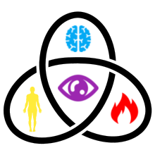
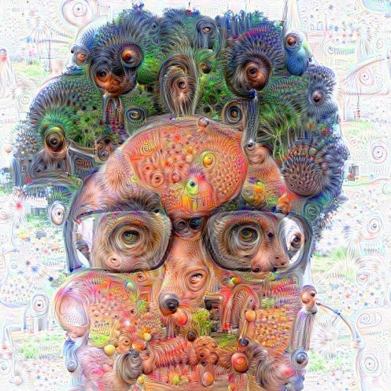

# Andrew Herman
 

 
## Introduction
 

Hi! I am a polymath with special interest in the nexus of art, technology and spirituality.

I am passionate about the philosophy and practical application of these three hallmarks of the human experience. Where do they intersect and overlap? How can they be applied to inspire, educate and heal?

Living a values-based lifestyle is very important to me. I deeply care about the impact of my actions on other people, animals, the planet and beyond. These are critical considerations in my work.

Scroll down to learn more about my projects and ideas. Let us celebrate and co-create together!
