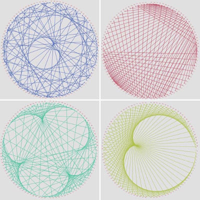

## Computer Technology
 

I have a B.S. in Computer Science & Engineering and 5+ years professional experience creating websites, software applications and interactive tools.

Some of my specific technology interests include:

* Application Design & Development
* Web Design & Development
* Information Systems & Data Structures
* Data Visualization & Simulation
* Algorithms & Automation

View some of my open-source projects below. Ask me about consulting/contract work for your web design/development project.

[Github](https://github.com/aherman){:target="_blank"}
[Codepen](http://codepen.io/hippiefuturist){:target="_blank"}
[Resume](doc/andrew_herman_resume_2017-5-4.pdf){:target="_blank"}
[LinkedIn](https://www.linkedin.com/in/andrew-herman-1683a422/){:target="_blank"}
[Email](#contact)
