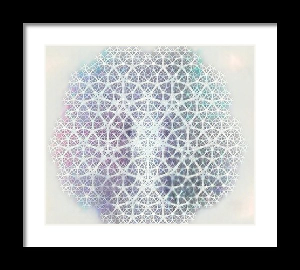
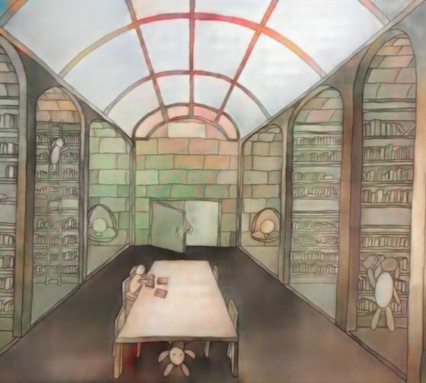

## Visionary Art
 

I frequently experiment with different artistic mediums, styles and themes. I enjoy pushing the definition of art through algorithmic generation and machine collaboration. I aim to use art as a medium for helping inspire a global paradigm shift in consciousness toward an abundant state of being.

Some of my specific art interests include:

* Sacred Geometry
* Algorithmic/Generative Art
* Pen and Pencil Drawing
* Photography and Editing
* Digital Animation
* Writing (blogging, poetry, short stories)
* Piano Composition
* Curation/Ideation

To see selected art prints available for sale visit my online store below. To see more projects visit my curated art portfolio and blog - Artopia. Or, follow me on Social media.

[Medium](https://medium.com/@andrew.herman){:target="_blank"}
[Instagram](https://www.instagram.com/hippie.futurist/){:target="_blank"}
[Soundcloud](https://soundcloud.com/hippiefuturist){:target="_blank"}

  

    

    

      
        <h2>Fine Art Prints</h2>
    

    <a class="button" href="https://fineartamerica.com/profiles/4-andrew-herman/shop" target="none">Visit Online Shop</a>
    

    

      

        
          <h2>Artopia: Vision</h2>
      

      <a class="button" href="http://aherman.github.io/artopia" target="none">Visit Gallery</a>
    

  

