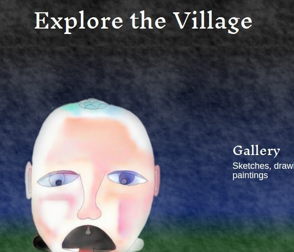

## Visionary Art
 

I frequently experiment with different artistic mediums, styles and themes. I enjoy pushing the definition of art through algorithmic generation and machine collaboration. I aim to use art as a medium for helping inspire a global paradigm shift in consciousness toward an abundant state of being.

Some of my specific art interests include:

* Sacred Geometry
* Algorithmic/Generative Art
* Pen and Pencil Drawing
* Photography and Editing
* Digital Animation
* Writing (blogging, poetry, short stories)
* Curation/Ideation

To see my work visit my curated art portfolio and blog - <a href="http://aherman.github.io/artopia" target="_blank">__Artopia__</a>, or one of my social media accounts.

[Artopia](http://aherman.github.io/artopia){:target="_blank"}
[DeviantArt](http://hippiefuturist.deviantart.com/){:target="_blank"}
[Medium](https://medium.com/@andrew.herman){:target="_blank"}
[Instagram](https://www.instagram.com/hippie.futurist/){:target="_blank"}
